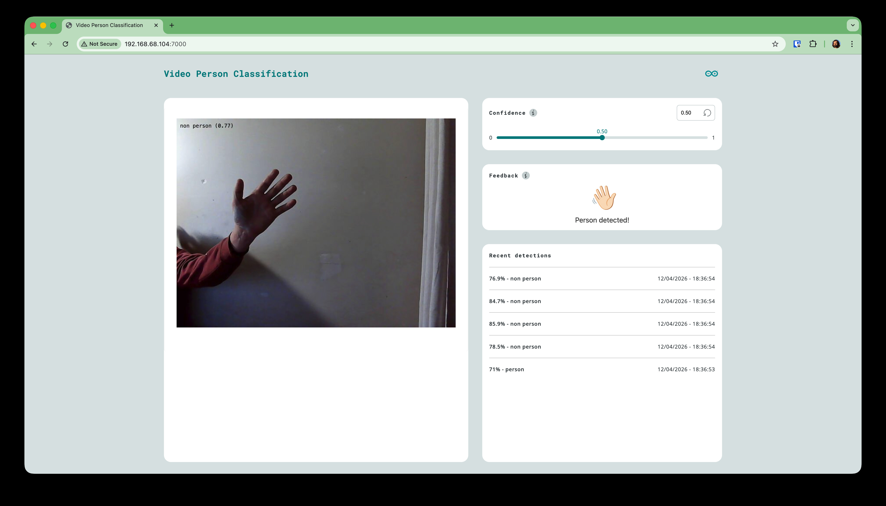
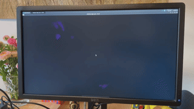

# Work Log

## TODO Links

- [ ] https://docs.arduino.cc/tutorials/uno-q/ssh/
- [ ] https://docs.arduino.cc/software/app-lab/tutorials/getting-started/#install--set-up-arduino-app-lab
- [ ] https://docs.arduino.cc/tutorials/uno-q/power-specification/

- What is mains earth leakage current? - build your own detector - ANT&TEC
    - https://www.youtube.com/watch?v=kI_9usgyoGY

- [ ] Ligt desing https://community.element14.com/challenges-projects/design-challenges/light-up-your-life/b/news/posts/winners-announcement---light-up-your-life-design-challenge?ICID=DCHmain-feature-widget

- [ ] UNO Q enclosure
    - https://community.element14.com/products/roadtest/b/blog/posts/arduino-uno-q---getting-started

- https://core-electronics.com.au/projects/

- [ ] recommended by skrugliewicz
  - Two Months with the Arduino Uno Q: Hackster PRO Jeremy Cook // Getting
    Started - Hackster.io, an Avnet community
    - https://www.youtube.com/watch?v=5jbS4puIlUs
    - https://www.hackster.io/news/hands-on-with-the-arduino-uno-q-74eabc1bd962

- [ ] probably want this on my mac as well
  - https://docs.arduino.cc/tutorials/uno-q/adb/
  ```sh
  brew install android-platform-tools
  adb version
  ```

- https://www.hackster.io/mferuscomelo/somnosphere-the-smart-bedside-lamp-4aea48
  - https://github.com/mferuscomelo/somnosphere-firmware

- [ ] **How to Learn LabVIEW—from Beginner to Expert—Straight from the Pros -
  NI Apps**

  [
     ](https://youtu.be/0udm5Pbx_bE)

  - [ ] https://www.gdevconna.org/resources
  - [ ] https://gcentral.org/categories/
  - [ ] https://sites.google.com/gcentral.org/website/g-community-resources
  - [ ] https://gcentral.org/categories/connect-with-others/

---

## Sat 30 May 2026

switch back to plain old `arduino-app-cli` on the UNO Q

```
ssh pollyanna.local
arduino-app-cli app new green-brain

App created successfully: /home/arduino/ArduinoApps/green-brain (ok)

cd ArduinoApps/green-brain/

arduino-app-cli app start .

  [INFO] Starting app "green-brain"
  Progress[preparing]: 0%
  Progress[sketch compiling and uploading]: 0%
  [INFO] Sketch profile configured: Name="default", Port=""
  [INFO] The library Arduino_RouterBridge has been added from sketch project.

  ...

  [INFO] Info : flash mode : dual-bank
  [INFO] Info : Padding image section 0 at 0x0810ebd8 with 8 bytes (bank write end alignment)
  [INFO] Warn : Adding extra erase range, 0x0810ebe0 .. 0x0810ffff
  [INFO] shutdown command invoked
  ERRO[0084] Stopped decode loop: EOF                      discovery="builtin:serial-discovery"
  Progress[sketch updated]: 10%
  ERRO[0084] Stopped decode loop: EOF                      discovery="builtin:mdns-discovery"
  [INFO] python provisioning
  Progress[python provisioning]: 10%
  [INFO] python downloading
  [INFO]  Network green-brain_default  Creating
  [INFO]  Network green-brain_default  Created
  [INFO]  Container green-brain-main-1  Creating
  [INFO]  Container green-brain-main-1  Created
  [INFO]  Container green-brain-main-1  Starting
  [INFO]  Container green-brain-main-1  Started
  Progress[]: 100%
  ✓ App "green-brain" started successfully

docker ps

  CONTAINER ID   IMAGE
  1ac96176a0bd   ghcr.io/arduino/app-bricks/python-apps-base:0.10.1
      COMMAND     CREATED         STATUS         PORTS     NAMES
      "/run.sh"   2 minutes ago   Up 2 minutes             green-brain-main-1

# on dev machine sync it back
rsync -av \
  --exclude='.cache/' \
  pollyanna.local:~/ArduinoApps/green-brain/ \
  experiments/in_app_new/
```

runs both in Linux and via App Lab

```
arduino-app-cli app start .
arduino-app-cli monitor
...
MCU received value: 152
MCU received value: 153
```

## Fri 29 May 2026

Dropping back to router bridge blink

```
arduino-cli lib search RouterBridge
arduino-cli lib install Arduino_RouterBridge
```
  'arduino-cli lib install "autowp-mcp2515"',

  mkdir

  rsync -av \
    experiments/in_can_bus/firmware/can_garden_hub/ \
    pollyanna:/home/arduino/green-brain/firmware/


~/green-brain/firmware$ arduino-cli compile --fqbn arduino:zephyr:unoq can_garden_hub

arduino-cli upload --fqbn arduino:zephyr:unoq ./can_garden_hub/
## Thu 28 May 2026

### Upload code

get `arduino-cli` tool on Mac (Already on UNO Q's)

```
brew install arduino-cli
# or
brew bundle
```

list boards

```
arduino-cli board list

Port                            Protocol Type         Board Name    FQBN                Core
192.168.68.128                  network  Network Port Arduino UNO Q arduino:zephyr:unoq arduino:zephyr
/dev/cu.Bluetooth-Incoming-Port serial   Serial Port  Unknown
/dev/cu.debug-console           serial   Serial Port  Unknown
```

but on the UNO I get both

```
arduino-cli board list

Port           Protocol Type         Board Name    FQBN                Core
192.168.68.127 network  Network Port Arduino UNO Q arduino:zephyr:unoq arduino:zephyr
192.168.68.128 network  Network Port Arduino UNO Q arduino:zephyr:unoq arduino:zephyr
```

seems like the arduino-router is the default to talk MCU to MPU
```
systemctl status arduino-router
```

seems there is a direct way to connect VSCode to UNO Q
- [https://github.com/johanwheeler/arduino-uno-q-vs-code-workspace](
  https://github.com/johanwheeler/arduino-uno-q-vs-code-workspace)
- or direct
  ```
  arduino-cli compile --upload --fqbn arduino:zephyr:unoq sketch.ino
  ```

may also need to stop the `arduino-router` if I am bypassing it

```
sudo systemctl stop arduino-router
```

needed to find a specific library

```
arduino-cli lib update-index
arduino-cli lib search mcp2515
```


### SSH connectivity

SSH keygen some new keys for the UNO Q
```
ssh-keygen -o -a 100 -t ed25519

find ~/.ssh/id_ed25519_UNO_Q*

/Users/michael/.ssh/id_ed25519_UNO_Q
/Users/michael/.ssh/id_ed25519_UNO_Q.pub
```

copy them to the UNO Q's

```
$ mkdir .ssh
chmod 700 .ssh
vi .ssh/authorized_keys
chmod 600 .ssh/authorized_keys
```

update local hosts

```
vi ~/.ssh/config

Host ammamaria
    HostName 192.168.68.127
    User arduino
    IdentityFile ~/.ssh/id_ed25519_UNO_Q
    IdentitiesOnly yes

Host pollyanna
    HostName 192.168.68.128
    User arduino
    IdentityFile ~/.ssh/id_ed25519_UNO_Q
    IdentitiesOnly yes
```

### RSync

needed to install on both machines

```
sudo apt-get install -y rsync
```

Seems I need to install node and npm

and stop the bridge

```
# one off
sudo systemctl stop arduino-router

# permanent disable
sudo systemctl disable arduino-router

# permanent enable
sudo systemctl start arduino-router
```

and kill off a spurios started node

```
ssh pollyanna
lsof -t -i:3001 | xargs kill -9
```

added screen

restarted


### bring boards online

Time to bring out the Arduino UNO Q - seems like the bug is fixed as I could update it from a terminal no problems. I did forget the password on my original one but I think all is well now.

I have:
- **pollyanna**
  ```
  ssh arduino@192.168.68.128
  ```
  - .
  ```
  UNO Q software update:
    arduino:zephyr Version 0.55.2
    arduino-app-cli Version 0.11.0
    arduino-app-lab Version 0.8.0
    arduino-cli Version 1.5.0
    arduino-router Version 0.9.0
  ```
  - space
  ```
  free -h
                 total        used        free      shared  buff/cache   available
  Mem:           1.7Gi       558Mi        41Mi       1.7Mi       1.2Gi       1.2Gi
  Swap:          870Mi        10Mi       859Mi
  ```
  - check what is installed
  ```
  apt list --installed | egrep 'zephyr|arduino-'

  WARNING: apt does not have a stable CLI interface. Use with caution in scripts.

  arduino-app-cli/stable,now 0.11.0 arm64 [installed]
  arduino-app-lab/stable,now 0.8.0 arm64 [installed]
  arduino-cli/stable,now 1.5.0 arm64 [installed]
  arduino-linux-config/stable,now 0.2.0 arm64 [installed,automatic]
  arduino-router/stable,now 0.9.0 arm64 [installed]
  arduino-unoq-config/stable,now 0.1.0 arm64 [installed,automatic]
  arduino-unoq-radio-firmware/stable,now 0.6.1 arm64 [installed,automatic]
  arduino-unoq/stable,now 0.1.0 arm64 [installed]
  ```
- **ammamaria**
  ```
  ssh arduino@192.168.68.127
  ```
  - seems ssh was also not on
  ```
  sudo apt update
  sudo apt install openssh-server -y
  sudo systemctl enable ssh
  sudo systemctl start ssh
  ```
  - space
  ```
  free -h
                total        used        free      shared  buff/cache   available
  Mem:           1.7Gi       306Mi       1.1Gi       9.7Mi       385Mi       1.4Gi
  Swap:          870Mi          0B       870Mi
  ```
  - checking what is installed
  ```
  apt list --installed | egrep 'zephyr|arduino-'

  WARNING: apt does not have a stable CLI interface. Use with caution in scripts.

  arduino-app-cli/stable,now 0.11.0 arm64 [installed]
  arduino-app-lab/stable,now 0.8.0 arm64 [installed]
  arduino-cli/stable,now 1.5.0 arm64 [installed]
  arduino-router/stable,now 0.9.0 arm64 [installed]
  ```

I have updated both and turned both to non visual mode
```sh
  sudo systemctl get-default
  > graphical.target

  sudo systemctl set-default multi-user.target
```

## Wed 27 May 2026

Purchased some stuff
- 4x TSL2591 light sensor
- 20x TTP223 touch sensor for scout morse
- 15x PAM8403 audio amps for speaker system and scout sound
- 5x MAX6675 K Type Thermocouple - for thermocouples below
- 15x BMP280 temp, humidity and barometric pressure
- 5x LMC6001 op-amp for Field Mill
- 1x AD8317 RF sensor

Also not purchased but I should have 5x Magnetometer `QMC5883L`

Looked at state of Cameras and UNO Q

- Arducam is probably what you want [Google: q=arducam](
https://www.google.com/search?q=arducam)
- Core electronics [Core: Arducam 5MP OV5647 Camera Module with M12 Lens](
  https://core-electronics.com.au/arducam-5mp-ov5647-camera-module-with-m12-lens.html)
  $28.55 using dedicated CSI interface
- Discussion on [JMEDIA camera break out board](
  https://forum.arduino.cc/t/uno-q-jmedia-camera-linux-support/1423090)
- Discussion on [UNO Q: JMEDIA and JMISC - Are there any expansion cards?](
  https://forum.arduino.cc/t/uno-q-jmedia-and-jmisc-are-there-any-expansion-cards/1410569)
  - Crowd Supply IQL Camera bridge for UNO Q
    - [https://www.crowdsupply.com/image-quality-labs/iql-camera-bridge-for-arduino-uno-q](
      https://www.crowdsupply.com/image-quality-labs/iql-camera-bridge-for-arduino-uno-q)
  - UNO media carrier
    - [https://docs.arduino.cc/hardware/uno-media-carrier/](
      https://docs.arduino.cc/hardware/uno-media-carrier/)
    - [https://store-usa.arduino.cc/products/uno-media-carrier](
      https://store-usa.arduino.cc/products/uno-media-carrier) Coming soon $20
  - UNO breakout carrier
    - [https://docs.arduino.cc/hardware/uno-breakout-carrier/](
      https://docs.arduino.cc/hardware/uno-breakout-carrier/)
    - [https://store-usa.arduino.cc/products/uno-breakout-carrier](
      https://store-usa.arduino.cc/products/uno-breakout-carrier) coming soon
      $10
- vs cheap "OV2640 Camera Module 2MP Megapixel STM32F4 Driver Source Code
  Support JPEG Output for Arduino" ~8
  - [https://www.aliexpress.com/item/33046344720.html](
    https://www.aliexpress.com/item/33046344720.html)

## Tue 26 May 2026

Current scheme of work planned:
- [ ] can garden hub - read and display (via web) output using UNO Q
- [ ] get the shield working
- [ ] get the thermocouples working
- [ ] get the water cannon working
- [ ] look at deploying AI models to UNO Q
  - [ ] investigate pot plant detection as well as plant health
- [ ] hook up NI LabView to combined output of garden hub

Researching other things that could be measured

Using 10 meter tree out the back

> The lapse rate in free atmosphere is ~6.5°C/km, so 10m "should" give you
> 0.065°C — boring. But near the ground things are very different:
>
> - Night: Ground radiates heat, cools fast → temperature inversions where the
>   air 1–2m above ground is colder than air at 10m. Differences of 2–4°C on a
>   clear calm night are common
> - Day: Canopy shading, soil evaporation, different airflow — the tree itself
>   creates a microclimate
> - Humidity: Higher near ground due to soil moisture and canopy transpiration —
>   BME280 at both ends would show this clearly
> - Rain events: The gradient flips and changes rapidly
>
> Short answer: yes, particularly at dawn/dusk and clear nights.

Sensors:

- 3 Cup Anemometer ~ $15 but big and clumsy
- wind vane ~ $20 still clumsy
- tree sway and vibration using MPU-6050 ~ $2
- pressure BME280 ~ $2
- tipping bucket rain gauge ~ $2 - $20
- Light/UV with `TSL2591` ~$4 for lux and `ML8511` ~ $40 for UV
- CO2 with `SCD41` ~ $30 - a gradient may appear depending on the tree imnpact
- Particulate matter `PMS5003` ~ $15 real time PM2.5/PM10 measurement < 10s
  often lower at height and may be impacted by rain
- Infrared sky temerature `MLX90614` ~ $2 - $15 pointed up to detect cloud
  cover, can measure the effective sky temperature for radiative cooling
  calculations, correlates with ground frost riks
- Magnetometer `QMC5883L` ~ $5 magnetic fied changes around lightning storms

where 10 meters would be 1.2hPa - BME280 resolves to 0.18 Pa so could confirm
height but more interesting if storm fronts pass.

Atmospheric electric potential gradient of fair-weather field. Between the
negatively charged earth's surface and the ionosphere ~50km up which is
positively charted. In fair weather that is ~ 100 - 150 V/m near the surface.
With a 10m tree that is ~ 1-1.5 kV. It is a global electric circuit driven by
thunderstorm activity worldwide and the "Carnegie curve" shows its daily
variation. During thunderstorm activity it could jump to 10's kV/m.

To measure it you could build a "Field mill" (rotating shutter) classic
instrument. A small DC motor spins a foil plate, the shutter, and a high
impedance op-amp `LMC6001` or similar detects between it and the stationary
plate. `LMC6001` ~ $1 (E14 etc)

A simpler approximation can be done by 2 vertical attenas at different heights
with a high-impedance differential amplifier - will detect changes and storm
approach.

There is also the "electret capsule hack" where removing the membrane of a mic
capsule creates a crude field sensor using the built-in FET buffer

A bunch of Field Mill instructions
[https://www.google.com/search?q=diy+field+mill](https://www.google.com/search?q=diy+field+mill)
- [digikey: DIY static charge field detector using arduino and TL071
  ](https://www.digikey.com.au/en/maker/projects/diy-static-charge-monitor-electrostatic-field-detector-arduino-tl07/51804380daaf4217be4302379de7bdef)
- [https://www.instructables.com/E-Field-Mill/](https://www.instructables.com/E-Field-Mill/)

Shopping list - needs to be here well before 21 June deadline:

- [ ] MAX6675 temperature sensor module 5 for $20
  https://www.aliexpress.com/item/1005007864041833.html
  - or more accurate MAX31855
- [ ]

- BME280 pressure detector~ $2
- tipping bucket rain gauge ~ $2 - $20
- Light/UV with `TSL2591` ~$4 for lux and `ML8511` ~ $40 for UV
- CO2 with `SCD41` ~ $30 - a gradient may appear depending on the tree imnpact
- Particulate matter `PMS5003` ~ $15 real time PM2.5/PM10 measurement < 10s
  often lower at height and may be impacted by rain
- Infrared sky temerature `MLX90614` ~ $2 - $15 pointed up to detect cloud
  cover, can measure the effective sky temperature for radiative cooling
  calculations, correlates with ground frost riks
- Magnetometer `QMC5883L` ~ $5 magnetic fied changes around lightning storms

where 10 meters would be 1.2hPa - BME280 resolves to 0.18 Pa so could confirm
height but more interesting if storm fronts pass.

Atmospheric electric potential gradient of fair-weather field. Between the
negatively charged earth's surface and the ionosphere ~50km up which is
positively charted. In fair weather that is ~ 100 - 150 V/m near the surface.
With a 10m tree that is ~ 1-1.5 kV. It is a global electric circuit driven by
thunderstorm activity worldwide and the "Carnegie curve" shows its daily
variation. During thunderstorm activity it could jump to 10's kV/m.

To measure it you could build a "Field mill" (rotating shutter) classic
instrument. A small DC motor spins a foil plate, the shutter, and a high
impedance op-amp `LMC6001` or similar detects between it and the stationary
plate. `LMC6001` ~ $1 (E14 etc)

## Fri 8 May 2026

What is NI LabView

- **Getting Started With the LabVIEW Interface for Arduino - VI Shots**

  [
     ](https://youtu.be/RhdnmFJcFA0)

  - connect via USB
  - NI-VISA drivers
  - Arduino VI package and drivers

- **Using NI LabVIEW Case Structures - NI Apps**

  [
     ](https://youtu.be/I6M57RCnl5I)

  - data acquisition and control
  - how to connect ot arduion
  - what COM port is the arduino connected on - by UART?
  - add Hobbist -> Open.vi -> block diagram serial
    - sub VI for the serial to update it
  - DEPRECATED Aug 1 2020
    - [https://www.labviewmakerhub.com/doku.php?id=learn:tutorials:libraries:linx:misc:custom_command_example](
      https://www.labviewmakerhub.com/doku.php?id=learn:tutorials:libraries:linx:misc:custom_command_example)
  - a lot of click ops

- **LabVIEW + Arduino Uno + DHT22 Data Display - Johnny Palma**

  [
     ](https://youtu.be/AQbDNGDQAws)

  - Arduino and DHT22 (more accurate than DHT11)
  - some details of a loop and some text to number conversion as well as a
    delaying factor ¯\_(ツ)_/¯


- **NI LabVIEW 2025 | The Future of Test Software & AI - NI Apps**

  [
     ](https://youtu.be/dVFGMxfihOQ)

  - run in docker on linux
  - Community edition on Mac - free for makers
  - Nigel AI

- **NI LabVIEW Basics Part 1: Creating a VI - NI Apps**

  [
     ](https://youtu.be/OBcwsJb01F8)

  - VI - Virtual Instrument
  - block diagram and instrument panel

- **What's new in NI LabVIEW 2026 Q1 - NI Apps**

  [
     ](https://youtu.be/3lqDOZL1wik)

  - concept of controls, set a frequency or a wave form - can that be used to
    control some hardware?
  - Nigel AI - code completion across the whole system and LabView+ suite -
    LabView 2026 Q1
  - diff features - LabView compare
  - "mark of the web" - approve and accept externally downloaded code
  - Project wide debug settings
  - 3rd party languages - .Net
  - CI/CD workflows on docker hub
    - https://hub.docker.com/r/nationalinstruments/labview
    - windows docker
    - linux docker
  - web control
    - https://github.com/zeshanabdullah10/controlstack-web-bridge
    - use as a web browser from with LabView
    - can integrate web Plotly plots

- **Using NI LabVIEW Case Structures - NI Apps**

  [
     ](https://youtu.be/I6M57RCnl5I)
  - example of case statements - pretty simple but may be a way of getting
    started.

- **How to Connect Arduino to LabVIEW: Wiring, Setup, and Programming |
  Advanced Arduino Control Systems - Full Course**

  [
     ](https://youtu.be/SUbU0FSK_nw)

  - some driver to get to COM port
  - 7 hours of poor audio

## Thu 7 May 2026

- wrapped up the 2 node comms using Arduino Nano
- had some issues generating the video and playing via Jekyll

> All three are now BT.709. Jekyll serves static files directly so the updated
> file should be live immediately — hard refresh the browser (Cmd+Shift+R) to
> bypass the cache and test again.

> The root cause: the iPhone 13 Pro records in Dolby Vision/HLG (BT.2020 HDR),
> and even though we re-encoded to H.264, ffmpeg was copying the HDR color
> metadata. Browsers that encounter HLG metadata on an H.264 stream can fail to
> decode beyond a certain point.

```sh
ffmpeg -y -ss 5 -i $USER/Downloads/IMG_XXXX.MOV \
    -an \
    -vf "setpts=PTS/1.5,setparams=color_primaries=bt709:color_trc=bt709:colorspace=bt709" \
    -c:v libx264 -crf 28 -preset fast \
    -maxrate 1500k -bufsize 3000k \
    -pix_fmt yuv420p \
    -movflags +faststart \
    green-brain/docs/assets/20260507_01_two_CAN_nodes.mp4
```

Key flags:
- -ss 5 — skip first 5 seconds
- -an — no audio
- setpts=PTS/1.5 — 1.5x speed
- setparams=...bt709 — force SDR color metadata (fixes the browser playback bug)
- -crf 28 -maxrate 1500k — keeps it under 10MB

## Thu 22 Apr 2026

added a Jekyll Github pages blog using the commands

```sh
mise use ruby@3.2.2
gem install jekyll bundler
jekyll new docs

cd docs

# downgrade jekyll to 3.9.6
# gem "jekyll", "~> 3.9.5" # to work with github-pages
bundle add github-pages webrick

# configure the _config.yml

# run
bundle exec jekyll serve --port 8888

# open
http://127.0.0.1:8888/green-brain/
```

## Thu 16 Apr 2026

- Very thorough overview of all the capabilities of the UNO Q
  [Element14 community: roadtest of UNO Q by skruglewicz](
  https://community.element14.com/products/roadtest/rv/roadtest_reviews/1894/)
- in particular a bunch of useful technical links, some linux command like
  `sudo halt` and the fact the board triggers a restart if you do a `sudo
  poweroff`.
- also all the connectors and the kinds of screens and cammeras you can connect.

## Sun 11 Apr 2026

### running headless

- Once working I ran blink and then a web cam person detector.
- the machine ground to a halt and even crashed.
- it was running docker, a web server, the model, Debian with a windows
  manager, etc
- I turned off the visual login
  ```sh
  sudo systemctl get-default
  > graphical.target

  sudo systemctl set-default multi-user.target

  # to turn visual back on
  systemctl set-default graphical.target
  ```
- I could now run an app headless
  ```sh
  arduion-app-cli
  arduino-app-cli
  arduino-app-cli brick
  arduino-app-cli brick list

  # see what I have had running
  docker ps --all

  # seems the apps is what I need to run
  arduino-app-cli  app
  arduino-app-cli  app list
  arduino-app-cli  app start examples:video-person-classification

  # and now running docker
  docker ps
  CONTAINER ID
  d6e77c80cd1e
    IMAGE       ghcr.io/arduino/app-bricks/python-apps-base:0.8.0
    COMMAND     "/run.sh"
    CREATED      33 minutes ago
    STATUS      Up 32 minutes
    PORTS        0.0.0.0:7000->7000/tcp, :::7000->7000/tcp
    NAMES       var-lib-arduino-app-cli-examples-video-person-classification-main-1

  9a8391ccb97e
    IMAGE       ghcr.io/arduino/app-bricks/ei-models-runner:0.8.0
    COMMAND     "/home/arduino/start…"
    CREATED     33 minutes ago
    STATUS      Up 33 minutes (unhealthy)
    PORTS       0.0.0.0:4912->4912/tcp
    NAMES       var-lib-arduino-app-cli-examples-video-person-classification-ei-video-classification-runner-1
  ```
- now just get the IP and check it out in the browser
  ```sh
  # via a shell session to the Arduino UNO Q
  hostname -I

  # on another computer on the network
  open http://192.168.68.104:7000/
  ```



### Setup

- unpacked the Arduino UNO Q 2GB
- plugged it in
- connected to network
- started configuring it "on the device"
- it updates
- and once I try to enter the the Linux Credentials - the page keeps
  refreshing!!!
    - over and over again

      

    - finally worked out how to look at the system log
      ```sh
      journalctl -f
      ```
    - seems like there were some issues
      - something to do with `/dev/ttyGS0`
      - and restarting SSH?
- assumed that I needed to restart and remove any half configured startup
  information
  ```sh
  rm -rf \
    .local/share/app-lab \
    .cache/app-lab/

  sudo apt-get remove app-lab
  sudo apt-get install app-lab --yes
  ```
  - still no luck, somehow it still remembered where in the setup process it
    was and hence would endlessly reload.
- Next I attempted to download the source off App Lab to work out where these
  secrets are stored
  ```sh
  git clone github.com:arduino/arduino-app-lab.git
  ```
  - this suggested `secret-tool` but after installing and not seeing anything I
    decided to give up on the path to fix the broken, looping install and to
    flash the UNO Q from scratch.

### Re flashing the UNO Q

following
- [https://core-electronics.com.au/guides/how-to-reinstall-linux-on-the-uno-q-arduino-reflashing-guide/](
  https://core-electronics.com.au/guides/how-to-reinstall-linux-on-the-uno-q-arduino-reflashing-guide/)
- and
- I downloaded the flasher [https://www.arduino.cc/en/software/#flasher-tool](
  https://www.arduino.cc/en/software/#flasher-tool)
  ```bash
  cd arduino-flasher-cli-0.5.0-darwin-arm64
  ./arduino-flasher-cli
  ./arduino-flasher-cli flash latest
  ./arduino-flasher-cli flash list
  ./arduino-flasher-cli flash 20251229-457
  ./arduino-flasher-cli flash 20251127-441
  ```
- but after running a really long download - the file is put in temp and
  disappears. This got frustrating. I took a look at the source:
  - [https://github.com/arduino/arduino-flasher-cli.git](
    https://github.com/arduino/arduino-flasher-cli.git)
  - from here it seems the images are found via
    [https://downloads.arduino.cc/debian-im/Stable/info.json](
    https://downloads.arduino.cc/debian-im/Stable/info.json)
- I attempted `latest` 20251229-457` which errored and `20251127-441` which did
  something different. Finally I put on `latest` again and decided to connect
  via my laptop.

### It Worked

Connecting via laptop to setup App Lab was the trick - it needs this to set
everything up for the first boot and it CANNOT HAPPEN ON the device - things
learned I guess.
